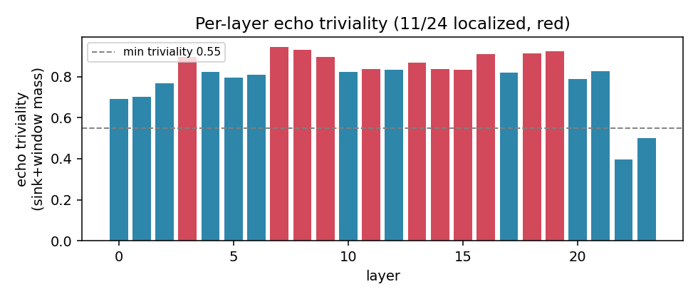
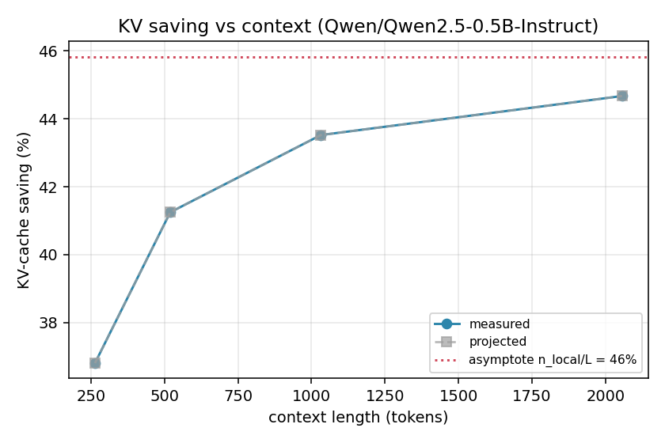
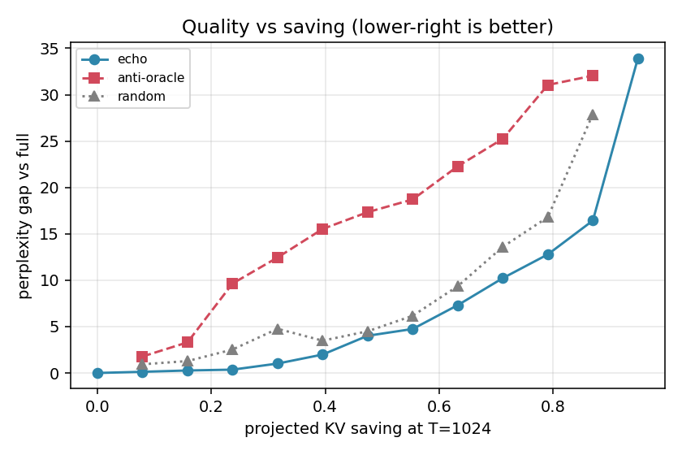
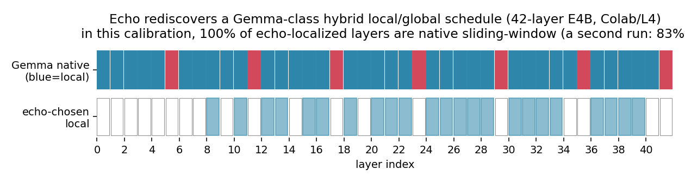

# echokv

> **Training-free KV-cache compression from the attention echo space** — shrink the
> key–value cache a transformer carries at inference with **no training and a single
> calibration batch**.

[](https://github.com/MGALIKE/Echo_KV/actions/workflows/ci.yml)
[](LICENSE)
[](pyproject.toml)
[](https://github.com/astral-sh/ruff)
[](benchmarks/check_claims.py)

`echokv` uses the *attention echo space* — a closure structure whose kernel is the
attention sink — to classify which layers genuinely retrieve from far back and which
only look locally. The local ones run on a tiny `sink + window` cache that stops
growing with context; the rest keep their full cache. **The classification is the
point:** it tells you *which* layers are safe to shrink, so you do better than cutting
the cache uniformly.

It is the engineering form of experiments **X9 / X10 / X11** in the accompanying
paper, and it independently **rediscovers the hand-designed local/global layer
schedules** that Gemma, Mistral and gpt-oss ship.

```text
calibrate(model, tok)  ->  EchoSchedule (which layers are local)  ->  echo_generate(...)
                                                                       memory-bounded cache
```

**Contents** ·
[Install](#install) ·
[Quickstart](#quickstart-library) ·
[Compose](#compose-with-quantization-and-value-aware-fronts) ·
[Honest numbers](#what-the-numbers-actually-are-honest) ·
[Results at a glance](#results-at-a-glance) ·
[Multimodal](#multimodal-vision-language-models) ·
[Limits](#honest-limits) ·
[How it works](#how-it-works-one-paragraph)

---

## Install

```bash
# from source (recommended while pre-PyPI)
git clone https://github.com/MGALIKE/Echo_KV
cd Echo_KV
pip install -e .

# or, once released on PyPI:
pip install echokv
```

Requires `torch>=2.1` and `transformers>=4.45` (developed and tested on
transformers 5.3). `numpy` is the only other runtime dependency; `matplotlib` is
needed only for the benchmark figures.

## Quickstart (library)

```python
import torch, echokv
from transformers import AutoModelForCausalLM, AutoTokenizer

name = "Qwen/Qwen2.5-0.5B-Instruct"   # any current decoder works
tok  = AutoTokenizer.from_pretrained(name)
# Use bfloat16, NOT float16 — modern models (Qwen/Llama/Gemma) overflow fp16 (NaN).
model = AutoModelForCausalLM.from_pretrained(
    name, dtype=torch.bfloat16, attn_implementation="eager").cuda().eval()

# 1) calibrate once (any short text works; defaults are fine)
schedule = echokv.calibrate(model, tok, target_saving=0.4)
print(echokv.kv_saving_report(schedule, seq_len=4096))

# 2) check quality is preserved (fast, no generation)
print(echokv.evaluate_perplexity(model, tok, schedule))

# 3) generate with the real memory-bounded cache
prompt = tok.apply_chat_template(
    [{"role": "user", "content": "Summarise the theory of evolution in one sentence."}],
    tokenize=False, add_generation_prompt=True)
text, stats = echokv.echo_generate(model, tok, prompt, schedule, max_new_tokens=128)
print(text, f"\nKV saved {100*stats['kv_saving']:.0f}% at length {stats['final_len']}")
```

## Quickstart (CLI)

```bash
echokv calibrate Qwen/Qwen2.5-0.5B-Instruct --target-saving 0.4 --seq-len 4096 --check-quality
echokv generate  Qwen/Qwen2.5-0.5B-Instruct --chat --prompt "Explain attention sinks." --max-new-tokens 128
echokv generate  Qwen/Qwen2.5-0.5B-Instruct --chat --prompt "Explain attention sinks." --kv-bits 4   # + 4-bit quant
echokv benchmark --out runs/ --quick        # bundled reproduction figures
```

## Compose with quantization and value-aware fronts

Two training-free knobs stack on top of the layer schedule.

**Quantization (the *bit* axis).** `kv_bits` quantizes the kept cache KIVI-style
(per-channel keys / per-token values). It is orthogonal to the schedule's *token* axis,
so the savings multiply — `~50% tokens × 4-bit ≈ 87%` of the fp16 KV bytes, at a small,
near-constant quality cost (validated on Qwen2.5-0.5B/3B/7B, n=100 needle survival:
4-bit costs a near-constant ~0.05 of retention at any localization level).

```python
text, stats = echokv.echo_generate(model, tok, prompt, schedule,
                                   max_new_tokens=128, kv_bits=4)   # 8 ~lossless, 4 aggressive
print(f"{100*stats['kv_saving']:.0f}% tokens dropped, "
      f"{100*stats['kv_saving_with_quant']:.0f}% of fp16 KV bytes saved")
```

> `kv_bits` is fake-quant: quality is measured exactly, and the reported byte saving is
> what a packed int cache realises (a live VRAM drop from quant is future work).

**Value-aware fronts.** Beyond *which* layers are local, `front_policy` chooses *which*
long-range keys a local layer keeps in its frozen front block (beyond the kernel sink),
reading the cached values only (FlashAttention/SDPA-compatible — no attention matrix):
`"positional"` (default, StreamingLLM-style), `"value_norm"` (largest ‖v‖, VATP-style),
or `"value_subspace"` (greedy pivoted Gram–Schmidt spanning the value subspace,
CurDKV-style). Spend a `front_budget` of extra keys on the local layers:

```python
text, stats = echokv.echo_generate(model, tok, prompt, schedule, max_new_tokens=128,
                                   front_policy="value_subspace", front_budget=32)
```

## One-command reproduction

```bash
make bench          # python -m echokv.benchmarks on a small model: JSON + figures
make test           # pytest
```

---

## What the numbers actually are (honest)

Measured locally on an RTX 3050 Ti (4 GB) on **Qwen2.5-0.5B-Instruct** (a
grouped-query model) and **GPT-2**, and on Colab L4 (labelled below) for 1B–8B
models. Full reproduction: [`benchmarks/BENCHMARKS.md`](benchmarks/BENCHMARKS.md).

- **Saving.** Making `K` of `L` layers local removes
  `K/L · (1 − (sink+window)/T)` of the per-token KV cache — and it **grows with
  context length** toward `K/L` (experiment X11). For a typical `K ≈ 0.45 L`
  schedule that is roughly **40–54 % at long context** on the tested models. This
  is a saving in **KV-cache memory**, which grows with context and batch — *not* a
  reduction in API token billing.
- **Quality.** In the light-to-moderate regime the held-out perplexity gap is small
  (e.g. **+1.8 at ~24 % saving** on Qwen2.5-0.5B; **+0.4** on GPT-2) and grows as the
  schedule turns aggressive (≈+4 near 47 %). More importantly the schedule
  **preserves deep retrieval** where a random same-size schedule does not (the needle:
  echo holds 0.92–0.97 of retrievals through 4 local layers vs a random mean of 0.41).
  The tool refuses to localize layers below `min_triviality`.
- **Peak memory.** `prefill_chunk` chunks the prompt and prunes after each chunk,
  cutting the eager-attention scratch from O(T²) to O(chunk·T): **~65 % lower peak
  at 4 k tokens** on Qwen2.5-0.5B (local, 4 GB; 3466→1199 MB). On large models at short context
  the *weights* dominate the peak, so the drop is small there and widens with
  context.

| model | arch | layers | local | KV saving | quality (ppl gap) | retrieval | where |
|---|---|---|---|---|---|---|---|
| Qwen2.5-0.5B-Instruct | GQA | 24 | 11 | 37→45 % (256→2k) | +1.8 @24 % saved (WikiText)† | needle 0.92–0.97 @K≤4 | local 4 GB |
| Qwen3-1.7B | GQA | 28 | 15 | 53 % | −0.46 (better) | `Vex`→`Vex` | Colab/L4 |
| Gemma E4B (multimodal hybrid, 42L)‡ | hybrid | 42 | 23 | 54 %\* | −0.65 (better) | `Vex`→`Vex` | Colab/L4 |

\* On a hybrid model the 54 % is versus an all-global baseline; the marginal gain
over the model's *own* native sliding-window cache is smaller (see Limits).
† Held-out WikiText perplexity gap in the light regime; it grows at more aggressive
savings (e.g. +4 near 47 %). Short-text perplexity is a weak proxy — the layer-choice
signal shows up in the retrieval needle and at long context, not here.
‡ Logged in the Colab notebook under `google/gemma-4-E4B-it`; this is most likely a
Gemma-3n E4B variant — confirm the checkpoint id (the finding is version-independent).

## Results at a glance

| Which layers are local (the classification) | KV-cache saving grows with context |
|:---:|:---:|
|  |  |
| Per-layer *triviality* on Qwen2.5-0.5B; red layers run on the bounded `sink+window` cache. | Measured KV saving rising toward the `n_local/L` asymptote (local 4 GB). |

| Quality vs saving (held-out perplexity) | Echo rediscovers Gemma's native schedule |
|:---:|:---:|
|  |  |
| GPT-2: echo **<** random **<** anti at every saving level. | Echo-chosen local layers vs Gemma's hand-designed sliding-window layers (Colab/L4). |

Every figure is produced by a script in [`benchmarks/`](benchmarks/) from logged JSON,
and [`benchmarks/check_claims.py`](benchmarks/check_claims.py) re-verifies all 33
headline numbers against those files. Full table + hardware labels:
[`benchmarks/BENCHMARKS.md`](benchmarks/BENCHMARKS.md).

## Multimodal (vision-language models)

A VLM's KV cache is dominated by **image tokens at the *start* of the sequence**. A
pure `sink + recent window` local layer evicts them, so once the model must re-read
the picture at *decode* time (long captions, multi-turn, a delayed answer) it goes
**blind** — short VQA hides this because the answer is baked in during prefill,
before any pruning. `echokv` protects a pooled subset of image tokens as
**anchors**: a local layer keeps `kernel + image-anchors + recent window`. For text
the anchor set is empty, so this is exactly the old behaviour (backward compatible).

```python
itid = echokv.image_token_id(model, processor)
text, stats = echokv.echo_generate(
    model, tok, None, schedule, inputs=inputs,   # inputs = processor output w/ pixel_values
    image_token_id=itid, image_budget=32, keep="anchor")  # keep="recency" = broken baseline
```

Validated on **SmolVLM-256M** with a decode-time image needle (all 30 layers local):
pure recency scores at chance (image evicted) while *uniform* anchor keeping restores
full grounding at roughly half the KV. Honest scope below.

## Honest limits

- **Use bfloat16.** Modern models overflow `float16` (NaN perplexity, `'!!!!'`
  output, zero layers picked). `calibrate()` raises a clear error if it detects this.
- **Single (unpadded) sequence.** `echo_generate` drives one sequence; batched
  left-padded generation needs padding-aware masking (not yet implemented).
- **Hybrid models.** On a model that *already* bounds its native sliding-window
  layers (Gemma's HybridCache), the headline saving is measured against an
  all-global baseline; the marginal gain over the native scheme is smaller. The full
  saving is real on non-hybrid models (Qwen, Llama).
- **`echo_eager` prefill does not replicate per-layer native sliding windows** — an
  approximation on hybrid models (works empirically; rougher fit).
- **Classifier, not ranker.** The echo structure wins as a *discrete classifier*
  (which layer/head is local) and *loses* as a continuous ranker — closure-coverage
  eviction merely ties H2O, and kernel mass is **not** a hallucination detector
  (both are documented negatives in the paper). Don't use it for per-key scoring.
- **echo-scored anchors are not better than uniform** for redundant visual signals
  (uniform coverage wins); fine-detail grounding under compression cannot be measured
  on sub-1B VLMs (the needle ceiling collapses). See the paper's Limitations.
- **Quality is a proxy** — perplexity and teacher-forced retrieval, not a full
  downstream benchmark.

## How it works (one paragraph)

The kernel `cl(∅)` of the attention echo space is the attention sink. A layer whose
heads put almost all their mass on the sink plus a recent window has a *trivial*
echo space — it retrieves nothing mid-range, so its cache can be the sink plus that
window. `echokv` ranks layers by that trivial mass on a calibration batch, makes the
most-trivial ones local, and serves them with a custom attention (`echo_eager`) that
builds its own causal mask so a local layer can hold a shorter cache than the global
layers without clashing with the framework's single shared mask. See `core.py`.

## License

Apache-2.0. See [LICENSE](LICENSE).

## Citation

If you use `echokv`, please cite the accompanying paper (manuscript in
preparation — citation details will be added here on release).
